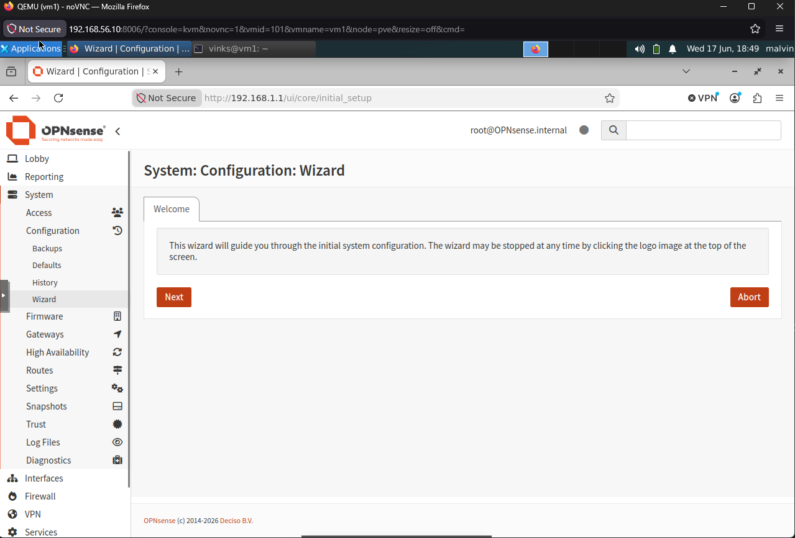
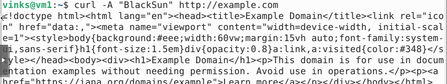
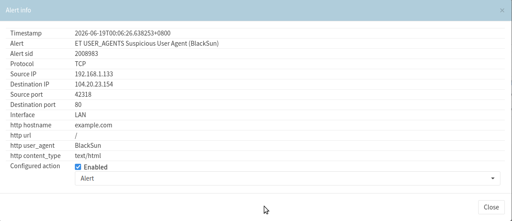
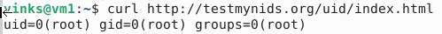
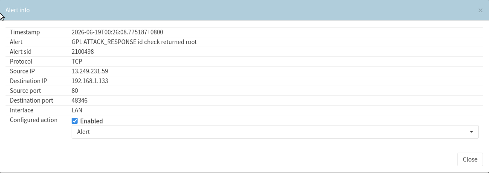

Steps I did to build a nested OPNsense firewall in Proxmox VE running inside VirtualBox on a Windows host.

## Table of Contents
- [Architecture](#architecture)
- [Section 1 — Create the two new bridges in Proxmox](#section-1--create-the-two-new-bridges-in-proxmox)
- [Section 2 — Download the OPNsense ISO](#section-2--download-the-opnsense-iso)
- [Section 3 — Create the OPNsense VM](#section-3--create-the-opnsense-vm)
- [Section 4 — Install OPNsense](#section-4--install-opnsense)
- [Section 5 — Assign interfaces and set LAN IP](#section-5--assign-interfaces-and-set-lan-ip)
- [Section 6 — Access the web UI](#section-6--access-the-web-ui)
- [Debug](#debug)
- [OPNsense Wizard Config](#opnsense-wizard-config)
- [OPNsense Intrusion Detection](#opnsense-intrusion-detection)

---

# Architecture 

```
Windows Host 
└── VirtualBox
    └── Proxmox VE (10.0.2.15 via NAT | 192.168.56.10 via Host-Only)
        ├── vmbr0 → VirtualBox NAT → Internet
        └── vmbr1 (inner bridge)
            ├── OPNsense VM
            │   ├── WAN → vmbr0 (upstream internet)
            │   └── LAN → 192.168.1.1 (gateway for inner VMs)
            └── VM1 (ID:101) — XFCE4 desktop
                ├── Gets DHCP from OPNsense (192.168.1.x)
                ├── Accesses OPNsense UI at http://192.168.1.1 via Firefox
                └── startx → launches XFCE4 desktop UI
```

---

## Section 1 — Create the two new bridges in Proxmox

In **Proxmox web UI** → your node → **Network** → **Create** → **Linux Bridge**

**Bridge 1 — WAN (vmbr0):**
| Field | Value |
|-------|-------|
| Name | `vmbr0` |
| Bridge ports | `enp0s3` (your NAT NIC) |
| IP address | *(leave blank — OPNsense owns this)* |
| Autostart | ✅ |

**Bridge 2 — LAN (vmbr1):**
| Field | Value |
|-------|-------|
| Name | `vmbr1` |
| Bridge ports | *(leave empty — purely internal)* |
| IP address | *(leave blank)* |
| Autostart | ✅ |

> **Why no IP on vmbr0?** OPNsense will own those networks. Proxmox just acts as a switch (layer-2). In fact, proxmox already has 192.168.56.10/24 for management purposes.

---

## section 2 — Download the OPNsense ISO

In the **Proxmox web UI** → your node → **local** storage → **ISO Images** → **Download from URL**

Grab the latest OPNsense DVD image from:
```
https://pkg.opnsense.org/releases/26.1.6/OPNsense-26.1.6-dvd-amd64.iso.bz2
```

---

## section 3 — Create the OPNsense VM

**Proxmox web UI** → **Create VM**

Walk through the wizard with these settings:

**General**
- VM ID: `100` (or any free ID)
- Name: `opnsense`

**OS**
- ISO: the OPNsense ISO you downloaded
- Guest OS type: **Other**

**System**
- Machine: `q35`
- BIOS: `SeaBIOS` (default)
- SCSI controller: `VirtIO SCSI`

**Disks**
- Bus: `VirtIO Block`
- Size: `16 GiB`
- Storage: `local-lvm`

**CPU**
- Cores: `2`
- Type: `host` *(important for nested — avoids emulation overhead)*

**Memory**
- RAM: `1024 MB` minimum; `2048 MB` recommended

**Network** — add **two** NICs

- **NIC 1** (WAN): Bridge = `vmbr0`, Model = `VirtIO (paravirt)`. faces the VirtualBox NAT network
- **NIC 2** (LAN): Bridge = `vmbr1`, Model = `VirtIO (paravirt)`. faces your interal VM network (e.g. VM1)

> **what is paravirtualization?** It's a method of virtualization that allows the guest OS to be aware that it's running in a virtualized environment, which can improve performance (lower CPU overhead and better disk throughput). VirtIO is a standard for network and disk device drivers that provides high-performance I/O.

You add the second NIC after the wizard via **Hardware** → **Add** → **Network Device**.

---

## section 4 — Install OPNsense

Start the VM and open the **Console** tab in Proxmox.

1. Boot from the ISO. At the login prompt, log in with:
   - Username: `installer`
   - Password: `opnsense`

2. Walk through the installer:
   - Keymap: choose yours (or accept default)
   - **Install (ZFS)** — recommended even in a VM
   - ZFS config: `stripe` (single disk), select `vtbd0` disk
   
3. When prompted, **change the root password**, then select **Reboot**. Remove the ISO from the CD drive before it boots again (Proxmox → Hardware → CD/DVD → Edit → set to "Do not use any media").

---

## section 5 — Assign interfaces and set LAN IP

After reboot, OPNsense boots to a CLI menu. 

**Step 5a — Assign WAN/LAN**

Choose option **1) Assign interfaces**:
- Do you want to configure LAGGs? → `n` (LAGG = Link Aggregation, not needed for a simple lab)
- Do you want to configure VLANs? → `n` (separate bridges used, not VLANs)
- WAN interface: `vtnet0`
- LAN interface: `vtnet1`
- Confirm with `y`

**Step 5b — Set LAN IP**

Choose option **2) Set interface IP address** → select `LAN`:
- Configure IPv4 via DHCP? → `n` (virtualbox NAT already does it the moment vtnet0 comes up)
- LAN IPv4 address: `192.168.1.1`
- Subnet bit count: `24`
- Upstream gateway? → press Enter (none for LAN)
- Configure IPv6? → `n`
- Enable DHCP server on LAN? → `y`
- Start of DHCP range: `192.168.1.100` (start at 100 to leave room for static IPs)
- End of DHCP range: `192.168.1.200`

The WAN (`vtnet0`) will get a DHCP address from the VirtualBox NAT range (10.0.2.x) automatically.

---

## section 6 — Access the web UI

Since the windows host can't directly reach `192.168.1.x` (that's inside vmbr1), the easiest option for a lab is to spin up a lightweight VM on the LAN side. This is where VM1 or any other extra VMs used:

1. downloaded xfce4 for a mini desktop UI environment, then installed firefox to access the OPNsense web UI. 
2. run http://192.168.1.1 on firefox of VM
3. `sudo ip addr flush dev eth0` then `sudo dhclient eth0` to clear out stubborn static ghost IP 
4.  `startx` to launch the desktop environment


```bash
curl -k https://192.168.1.1  # confirms web UI is up
```


**Default OPNsense credentials:**
- Username: `root`
- Password: whatever you set during install (or `opnsense` if you skipped it) 

---

## debug

**Hardware offloading issues:** If you see dropped packets or weird routing behavior, disable NIC offloading on the Proxmox host for those bridges:

```bash
ethtool -K vmbr0 gso off gro off tso off
ethtool -K vmbr1 gso off gro off tso off
```

Add these to `/etc/network/interfaces` under each bridge to persist across reboots:
```
post-up ethtool -K vmbr0 gso off gro off tso off
post-up ethtool -K vmbr1 gso off gro off tso off
```

**WAN won't get DHCP?** Verify that you have the correct NAT NIC with `ip a` — if your bridges are swapped, OPNsense's WAN will be on the wrong side.

---



## OPNsense wizard config

- hostname: OPNsense
- DNS: internal
- DNS server: 1.1.1.1
- override DNS: y
- enable resolver: y
- enable DNSSEC support: y
- harden DNSSEC data: y
- disable WAN: n
- type: dhcp
- mac(spoofed): n
- mtu: def
- mss: def
- dhcp hostname: def
- dont block rfc1918 privnet and bogon netwk
- ip addr: 192.168.1.1/24
- configure dhcp server: y
- optimize for multiwan: n
- auto dhcp/dns registration: y
- optimize for ipsec: n

## OPNsense intrusion detection
### enabled rules
`ET emerging-malware` — malware C2 traffic
`ET emerging-scan` — port/network scanners
`ET emerging-exploit` — known exploit patterns

***images to show OPNsense IDS setup is successful:***




